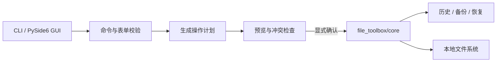

<div align="center">

# File Toolbox

**安全、可预览、可追溯的桌面文件批处理工具箱**

[](https://github.com/FelixJI/file-toolbox/actions/workflows/ci.yml)
[](https://github.com/FelixJI/file-toolbox/releases/latest)
[](pyproject.toml)
[](LICENSE)

[下载](#下载与使用) · [功能](#主要功能) · [开发](#从源码运行) · [源码导读](SOURCE_READING_GUIDE.md) · [贡献](#参与贡献)

</div>

File Toolbox 把批量重命名、批量建文件夹、生成 PDF、内容替换、考勤汇总、发票识别和
Excel 合并集中到同一个 CLI 与 PySide6 桌面界面中。批量重命名、内容替换、发票识别和
Excel 合并默认只预览结果，显式传入 `--yes` 才会执行；建文件夹会先列出将要创建的目录
清单，生成 PDF 在执行过程中逐文件报告进度。

> [!IMPORTANT]
> Word / Excel / PowerPoint 转 PDF、Word / Excel 内容替换和考勤汇总依赖 Windows 上的
> Microsoft Office（转 PDF 亦支持 WPS）；批量重命名、建文件夹、图片转 PDF、txt 替换、
> 发票识别和 Excel 合并可在 Windows、macOS 和 Linux 上使用。

## 主要功能

| 能力 | CLI | GUI | 说明 |
| --- | :---: | :---: | --- |
| 批量重命名 | ✓ | ✓ | 默认预览、冲突检测、历史与恢复 |
| 批量创建目录 | ✓ | ✓ | 从层级文本或表格生成目录结构，预览后创建 |
| 生成 PDF | ✓ | ✓ | Word/Excel/PPT/图片转 PDF，可合并；Office 转换仅 Windows + Office/WPS |
| 内容替换 | ✓ | ✓ | Word/Excel/txt 批量替换，默认预览、执行前自动备份 |
| 考勤汇总 | — | ✓ | 按 Excel 考勤表方案汇总，预览后另存；仅 Windows + Excel |
| 发票识别 | ✓ | ✓ | 解析 PDF/OFD/XML 电子发票，导出 Excel/JSON，支持去重 |
| Excel 合并 | ✓ | ✓ | 多个 xlsx/xlsm 的全部工作表合并为一个工作簿，保留值与样式，工作表名防冲突，输出永不覆盖已有文件 |

## 下载与使用

### 使用发布包

1. 从 [Releases](https://github.com/FelixJI/file-toolbox/releases/latest) 下载
   `FileToolbox-v<version>-win-x64.zip`，解压到可写目录后运行 `FileToolbox.exe`。
2. 按同一 Release 的 `checksums.txt` 校验 SHA-256 后再运行。
3. 便携版由 Velopack 在应用内检查、下载并应用更新；请将解压目录放在无需
   管理员权限的可写位置，以保证自动更新可写回文件。

PowerShell 校验示例：

```powershell
Get-FileHash .\FileToolbox-v*-win-x64.zip -Algorithm SHA256
```

### 从源码运行

需要 [uv](https://docs.astral.sh/uv/) 与仓库锁定的 Python 版本：

```powershell
git clone https://github.com/FelixJI/file-toolbox.git
cd file-toolbox
uv sync --frozen --all-extras
uv run file-toolbox --help
uv run file-toolbox gui
```

先预览，再执行：

```powershell
uv run file-toolbox rename --dir ./samples --op "add_suffix:text=_done"
uv run file-toolbox rename --dir ./samples --op "add_suffix:text=_done" --yes
```

具体参数以 `uv run file-toolbox <command> --help` 为准。

### 日志与故障排查

GUI 把运行信息写入程序所在目录的 `.file_toolbox/logs/file-toolbox.log`（便携形态下数据
跟随程序一起携带，不落在用户主目录）；CLI 保持工作目录隔离，写入当前目录的
`.file_toolbox/logs/file-toolbox.log`。日志按 5 MiB 自动轮转并保留最近 5 份；
“关于”页可直接打开日志目录。界面出现“错误编号”时，请在反馈问题时附上该编号和对应时段的日志。

日志会记录操作类型、文件路径、异常调用栈和运行环境，不记录文档单元格、正文或发票内容。
分享日志前仍建议检查路径中是否包含不便公开的人员或项目名称。

界面无响应超过 10 秒时，程序会自动把所有线程的调用栈追加写入日志（含
“GUI 主线程疑似冻结”标记），恢复时记录本次冻结时长；反馈偶发卡死问题时请附上
对应时段的日志，线程栈会直接指向卡死位置。

## 工作方式



CLI 与 GUI 共享同一套 `file_toolbox/core` 实现。界面层负责收集输入与展示计划，核心层负责
规则解析、冲突检测和实际文件操作，因此新增能力时应先设计核心接口，再接入两个入口。

## 仓库地图

```text
file_toolbox/
├── cli/                 # Typer 命令、参数模型与终端输出
├── core/                # 文件操作、计划、历史与恢复
├── gui/                 # PySide6 窗口、控制器与生成界面
│   └── generated/       # 由脚本生成，不要手工编辑
└── gui_entry.py         # GUI 入口
tests/                   # 单元、集成与 CLI/GUI 回归测试
scripts/
├── regen_ui.py          # 生成/检查 Qt UI 代码
└── automation.py        # CI、构建与发布稳定入口
.ci/project.json         # 项目质量与发布契约
```

第一次阅读建议从 [`SOURCE_READING_GUIDE.md`](SOURCE_READING_GUIDE.md) 开始，沿一条
“重命名请求”纵向追踪 CLI、核心实现与测试。

## 开发与验证

```powershell
uv sync --frozen --all-extras
uv run ruff format --check .
uv run ruff check .
uv run mypy file_toolbox
uv run pytest
uv run python scripts/regen_ui.py --check
uv build
```

完整质量、构建和发布命令由 [`.ci/project.json`](.ci/project.json) 与
[`scripts/automation.py`](scripts/automation.py) 定义；GitHub PR 上的 `required` check 是最终门禁。

### 修改 GUI

`file_toolbox/gui/generated/` 是生成目录。修改 `.ui` 或生成输入后运行：

```powershell
uv run python scripts/regen_ui.py
uv run python scripts/regen_ui.py --check
```

不要直接修补生成文件。

## 发布资产

正式 Release 精确包含 Portable ZIP、Velopack full/delta nupkg/feed、`checksums.txt`、
`build-identity.json` 与 SPDX SBOM，不生成 Setup 安装器。版本与资产由自动化脚本生成；
贡献者不应手改派生版本或手工创建正式 tag。

## 参与贡献

1. 先阅读 [源码阅读指南](SOURCE_READING_GUIDE.md) 和根目录 `AGENTS.md`。
2. 从 `main` 创建主题分支，保持改动聚焦。
3. 为行为变化补充相邻测试，并运行相关质量命令。
4. 使用 Conventional Commit 提交并发起 PR。

## 许可证

本项目基于 [LICENSE](LICENSE) 中的条款发布。
