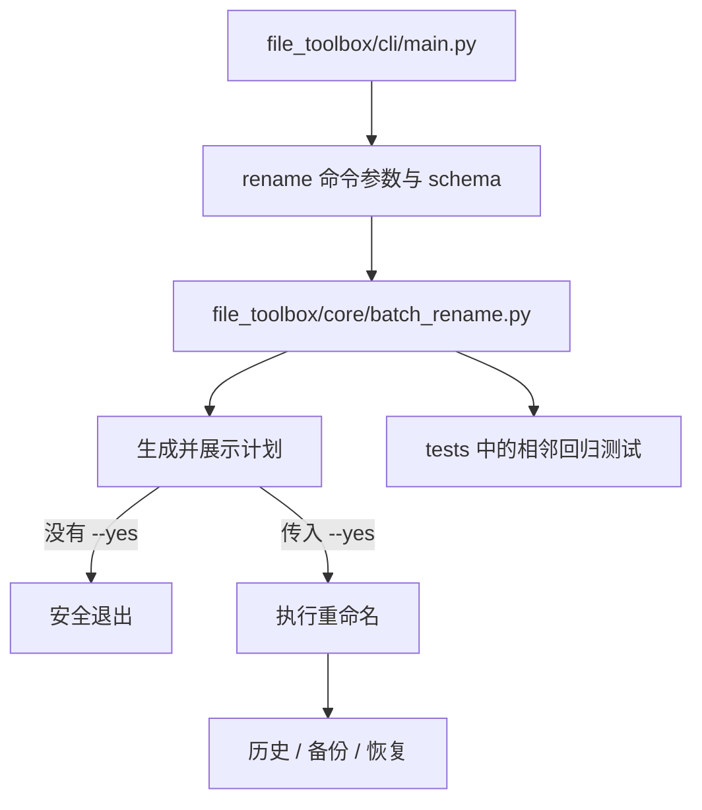

# File Toolbox 源码阅读指南

这份指南面向第一次接触仓库的贡献者。目标不是一次读完全部代码，而是先建立正确心智模型，
再沿一条真实操作链找到最适合自己的修改入口。

## 先记住三个边界

1. `file_toolbox/cli` 与 `file_toolbox/gui` 是入口，业务规则主要位于 `file_toolbox/core`。
2. 会修改文件的 CLI 命令默认只生成预览；`--yes` 是进入执行阶段的显式边界。
3. `file_toolbox/gui/generated` 是生成物，只能通过 `scripts/regen_ui.py` 更新。

## 10 分钟建立地图

先从配置和入口了解项目，而不是直接钻进某个转换器：

1. 读 `pyproject.toml`，确认 Python 版本、CLI entry point、依赖组和工具配置。
2. 读 `.ci/project.json`，了解 CI 真正运行的 bootstrap、quality、build 与 smoke 命令。
3. 读 `file_toolbox/cli/main.py`，查看命令如何注册。
4. 读 `file_toolbox/gui_entry.py` 和 `file_toolbox/gui/main_window.py`，了解 GUI 组合方式。
5. 浏览 `file_toolbox/core` 与 `tests` 的同名模块，建立“实现—测试”配对关系。

## 第一条纵向链：批量重命名

批量重命名同时覆盖参数解析、操作计划、冲突检查、文件写入和恢复机制，是最适合入门的路线。



阅读时逐个回答：

- 输入路径、规则与选项在哪里变成结构化参数？
- 计划阶段如何发现重名、非法路径或覆盖风险？
- 预览结果如何传回 CLI 或 GUI？
- `--yes` 在哪一层切换到真实写入？
- 部分操作失败时，历史记录保存了什么？

建议每读完一个生产文件，就在 `tests` 中搜索模块名、类名或错误消息。成功路径说明“应该怎样”，
失败测试则更清楚地说明接口边界。

## 第二条纵向链：GUI 如何复用核心

理解核心后，再从 `file_toolbox/gui/main_window.py` 选择一个功能页：

1. 找到窗口或控制器如何读取控件值。
2. 查看输入如何转换为与 CLI 相同或等价的操作参数。
3. 找到后台 worker/thread 的边界，确认耗时操作不会阻塞 UI。
4. 追踪计划、进度和错误如何回到界面。
5. 对照 GUI 测试，确认信号、状态和取消路径。

不要从 `gui/generated` 学业务逻辑；那里只应包含由 Qt UI 文件派生的界面代码。

## 按方向选择阅读路线

### CLI 与用户体验

阅读 `file_toolbox/cli`，重点关注 Typer 命令注册、参数类型、终端输出和退出码。新增 CLI 参数时，
应确认默认行为仍是预览，并补充 CLI runner 测试。

### 文件操作与可靠性

阅读 `file_toolbox/core` 中与目标功能相邻的模块，重点关注：

- 输入规范化与操作计划是否分离；
- 冲突检测是否在写入前完成；
- 错误是否携带足够上下文；
- 历史、备份与恢复是否保持一致。

### PySide6 桌面界面

从 `gui_entry.py` 进入，再读 `gui/main_window.py` 和目标功能对应的 controller/worker。UI 可见改动需要
运行生成一致性检查，并在 PR 中提供截图。

### Office 转换

这条路线仅适合 Windows 环境。先找平台能力检测与适配器，再进入 COM 调用；测试应区分纯逻辑测试和
需要真实 Microsoft Office 的集成验证。

### 构建与发布

按以下顺序阅读：

1. `.ci/project.json`
2. `scripts/automation.py`
3. `.github/workflows/ci.yml`
4. `.github/workflows/cd.yml`

项目脚本定义命令语义，workflow 负责 runner、job 拓扑和产物交接。

## 建议的首次修改流程

```powershell
uv sync --frozen --all-extras
uv run file-toolbox --help
uv run pytest <与你修改相邻的测试文件>
uv run ruff check <修改的 Python 路径>
uv run ruff format --check <修改的 Python 路径>
```

如果改动 GUI 生成输入，再运行：

```powershell
uv run python scripts/regen_ui.py
uv run python scripts/regen_ui.py --check
```

提交前再执行仓库质量入口。不要通过跳过测试、降低覆盖率或直接编辑生成物来让检查通过。

## 常见误区

- **把 CLI 与 GUI 各实现一遍业务逻辑**：共享规则应下沉到 `core`。
- **把预览当成附加功能**：预览是文件写入前的核心安全边界。
- **直接修改生成的 Qt 文件**：下一次生成会覆盖修改。
- **在非 Windows 环境调试 Office COM**：先确认平台与 Office 前置条件。
- **只读成功测试**：异常、冲突与恢复测试通常更能说明真实契约。
- **一开始就跑完整发布构建**：先运行相邻测试，只有修改打包、资源或发布逻辑时再跑相关 smoke。

## 读完后的自检

你应该能回答：

- 一个命令怎样从参数进入核心操作计划？
- 为什么没有 `--yes` 时不能写入文件？
- CLI 与 GUI 在哪里复用同一实现？
- 哪些文件是生成物，应该用什么命令更新？
- 修改某个功能后，最小相关测试和完整门禁分别是什么？

能回答这些问题，就已经具备完成第一个聚焦 PR 所需的仓库地图。
